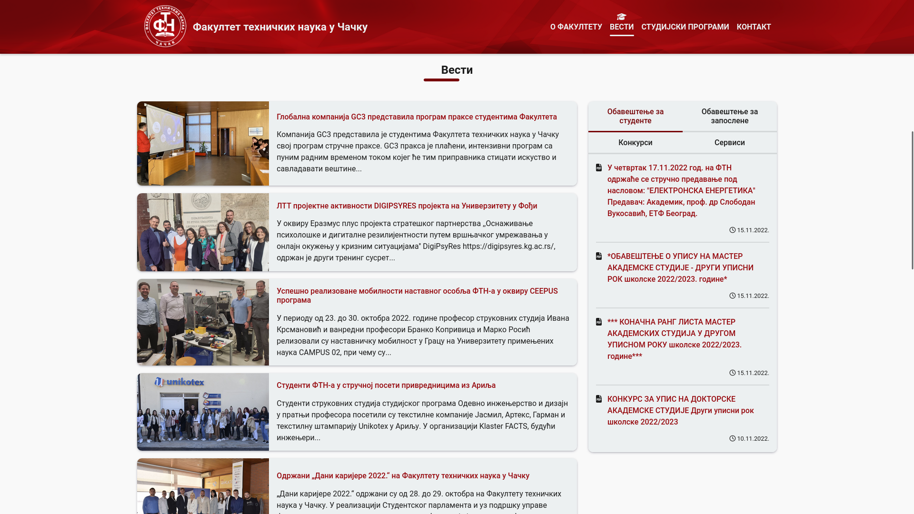

# FTN Čačak - Web Presentation

U okviru domaćeg zadatka potrebno je osmisliti dizajn (wireframe) jedne stranice i izraditi HTML/CSS stranicu na osnovu dizajna. Za dizajn izgleda stranice možete koristiti bilo koji softver (Adobe XD, Figma, Canva, Mockflow, itd.)

Stranica treba ukratko da predstavi FTN u Čačku (opšti podaci, logo, studijski programi, kontakt, itd.). Obavezno kreirati CSS meni. Možete dodati i druge sadržaje (fidove sa FTN naloga na društvenim mrežama, linkove i sl.) za koje smatrate da bi unapredili samu stranicu (prezentaciju fakulteta).

Koristiti HTML semantičke elemente, kao i neke od CSS efekata po izboru. Za layout možete koristiti float, Flexbox, ili Grid (npr. Bootstrap nije dozvoljen).

Stranica se postavlja na Azure veb sajtu koji ćete kreirati (kreirati Web App - s obzirom da smo na predavanju aktivirali studentsku pretplatu, dovoljno je da se ulogujete na portal.azure.com i kliknete na Create Resource i zatim odaberete Web App - kao kada smo kreirali Web App za WordPress). Za postavljanje veb stranice i pratećih datoteka, koristite Kudu konzolu - naziv_vaseg_web_app.scm.azurewebsites.net i iz menija odaberete Debug Console i PowerShell).

Radi se pojedinačno. Prilikom predaje zadatka, kao resurse, navodite URL do stranice, postavljate zip-ovanu datoteku sa potrebnim datotekama (html, css, slike...) i layout/wireframe stranice kao sliku (jpg/png).

## Figma Wireframe

## Screenshots

## Demo

